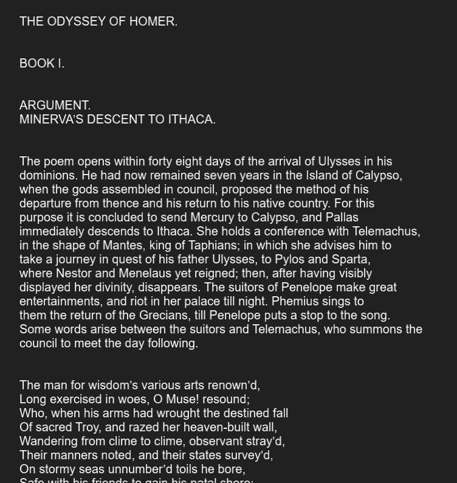
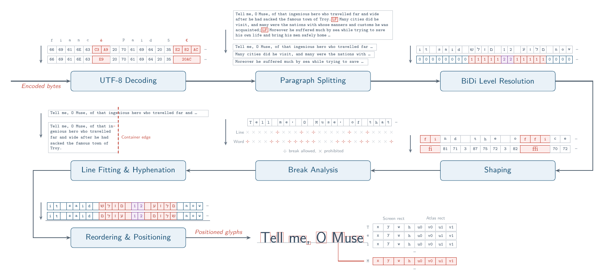
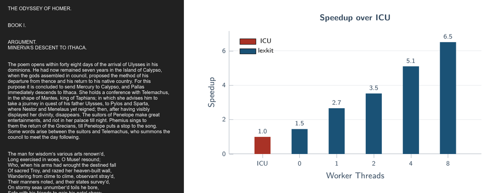

# lexkit

| | |
| ---- | ---|
|  |  |
| Rendering text in a variety of languages, scripts and directions with line breaking and hyphenation support. | Performing a layout of the entire text of *The Odyssey* in real-time with no caching.

Lexkit is a fast text layout library written in C. It takes a font, a piece of UTF-8 text and a region on screen to write it into as input, and it outputs a list of quads to render. It's flexible enough to work with arbitrary rendering engines and graphics APIs, and we provide examples using OpenGL on Windows. You can learn more about the implementation details from the following articles:

### A trip through the text rendering pipeline



### Optimizing text rendering


## Features

- Original implementations of the Unicode Line Breaking Algorithm, Bidirectional Text Algorithm that are up to 6.5x faster than the reference Unicode implementation ICU.
- Flexibility to cache at the font, text and layout level - avoid duplicate computation based on your application's needs!
- Supports custom allocators. Fast internal allocations via Arena allocators.
- Able to operate in entirely single-threaded or multithreaded modes.
- Fast multithreading using a lockless job queue.
- Built-in support for Unicode 16. Ability to load arbitrary versions of the Unicode standard from specification files ([Unicode Character Database](https://www.unicode.org/ucd/)).
```c
LkUnicodeSpecInfo spec = {0};
spec.str_path_lb     = "ucd/LineBreak.txt";
spec.str_path_wb     = "ucd/auxiliary/WordBreakProperty.txt";
spec.str_path_gb     = "ucd/auxiliary/GraphemeBreakProperty.txt";
spec.str_path_gc     = "ucd/UnicodeData.txt";
spec.str_path_eaw    = "ucd/EastAsianWidth.txt";
spec.str_path_incb   = "ucd/DerivedCoreProperties.txt";
spec.str_path_ep     = "ucd/emoji/emoji-data.txt";
spec.str_path_bidi   = "ucd/extracted/DerivedBidiClass.txt";
spec.str_path_bidipb = "ucd/BidiBrackets.txt";

LkArena* arena = lkArenaCreate();
LkUnicodeData ud = {0};
if (lkTryLoadUnicodeDataFromSpec(arena, &spec, &ud))
{
  LkContext ctx;
  lkCreateContext(&ud, 0, NULL, &ctx);
}
```

## Quickstart

Here's a quick snippet to render *"Hello World!"* using the Arial font on Windows:

```c
#include <lexkit/lexkit.h>
#include <lexkit/unicode_data_16.h>

LkContext ctx;
lkCreateContext(&g_lk_unicode_data, 0, NULL, &ctx); // Single-threaded mode

LkFont font;
lkCreateFont(&ctx, "C:/Windows/Fonts/Arial.ttf", 32, &font);  // Arial with font size 32

LkText text;
lkCreateText(&ctx, &font, "Hello World!", -1, &text);

LkVertexDescriptor_Text quads[256];
int32_t quad_count = 0;
lkLayoutText(&ctx, &font, &text, 800, 600, 256, quads, &quad_count);

// Each quad supplies x, y, w, h positions within the 800x600 rect.
//  As well as u_min, u_max, v_min, v_max extents within the font.buffer atlas.
//  DrawQuad is part of your renderer.
for (int32_t i = 0; i < quad_count; i++)
  DrawQuad(quads[i]);

lkDestroyText(&ctx, &text);
lkDestroyFont(&ctx, &font);
lkDestroyContext(&ctx);
```

## Build Instructions

We use the CMake build system. Currently, we support building on Windows 64-bit systems only.

1. Clone and build [HarfBuzz](https://github.com/harfbuzz/harfbuzz). Configure `LEXKIT_HARFBUZZ_DIR` to HarfBuzz root directory.
2. Clone and build [FreeType](https://freetype.org). Configure `LEXKIT_FREETYPE_DIR` to FreeType root directory.

The examples use OpenGL for rendering. Building shaders requires:

1. `glslangValidator`, from the Vulkan SDK, or [standalone](https://github.com/KhronosGroup/glslang/releases).
2. `xxd`, typically included with [Git for Windows](https://gitforwindows.org/)

## License Information

This work is made available under the [MIT License](LICENSE.txt)

All included third party license information is in `ThirdPartyLicenses.txt`.
